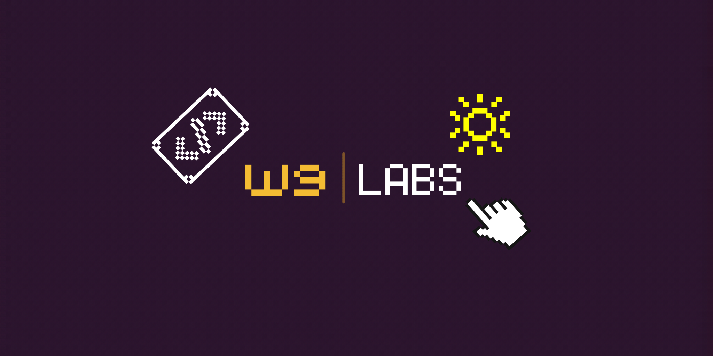
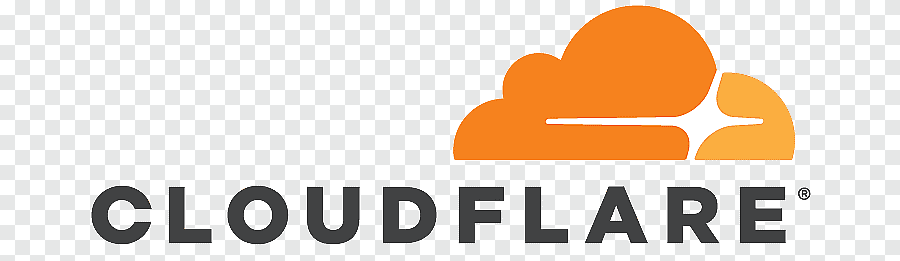
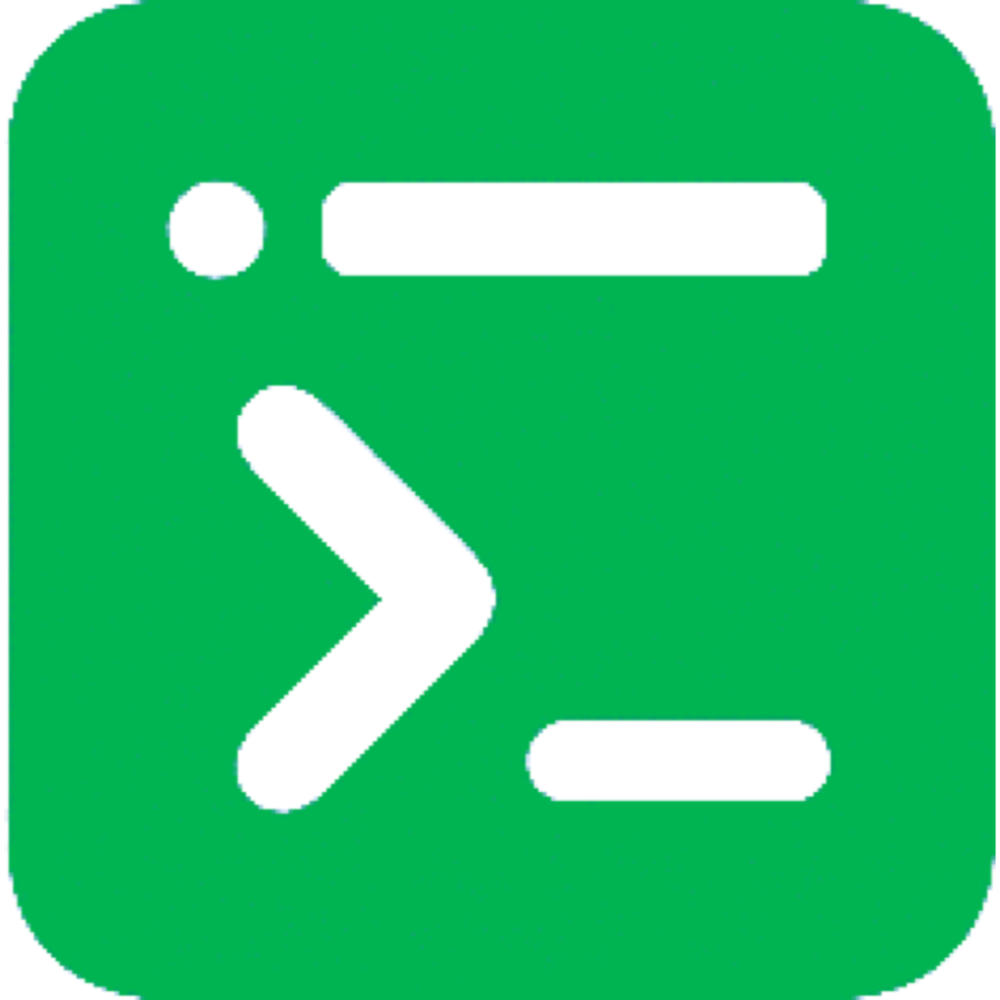
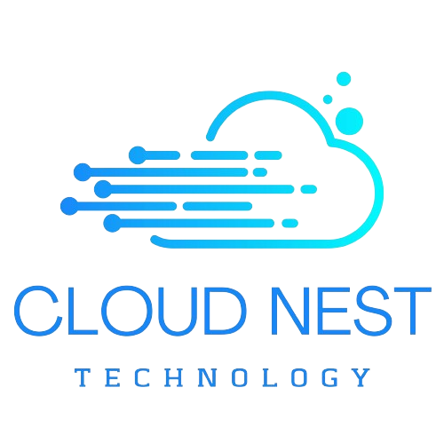
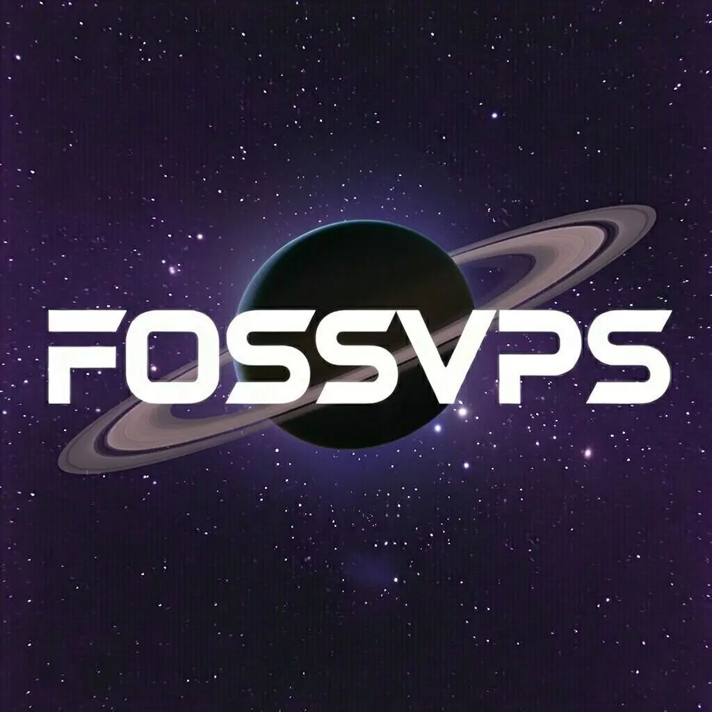
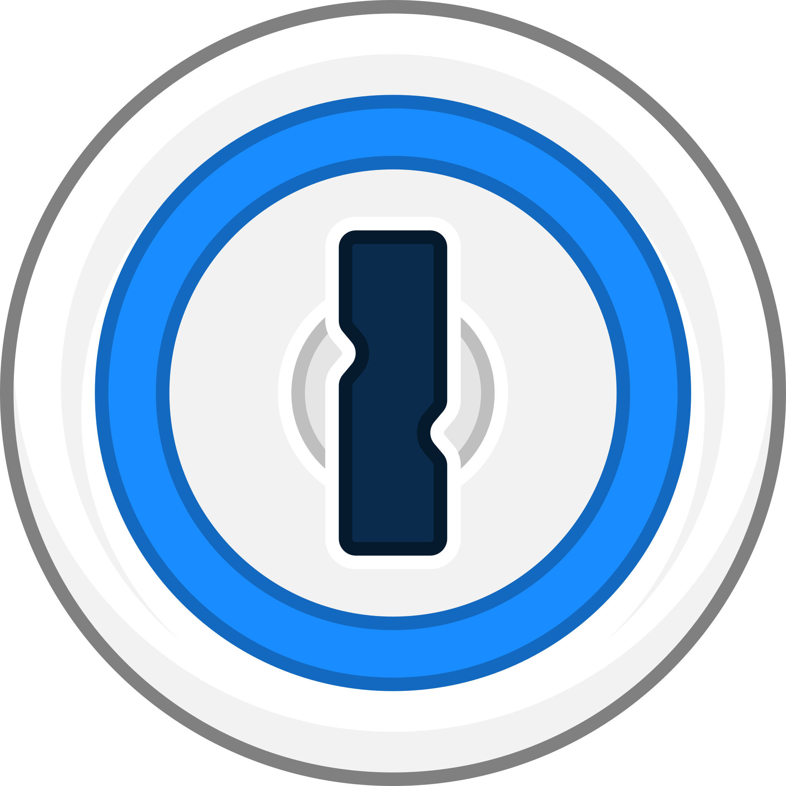
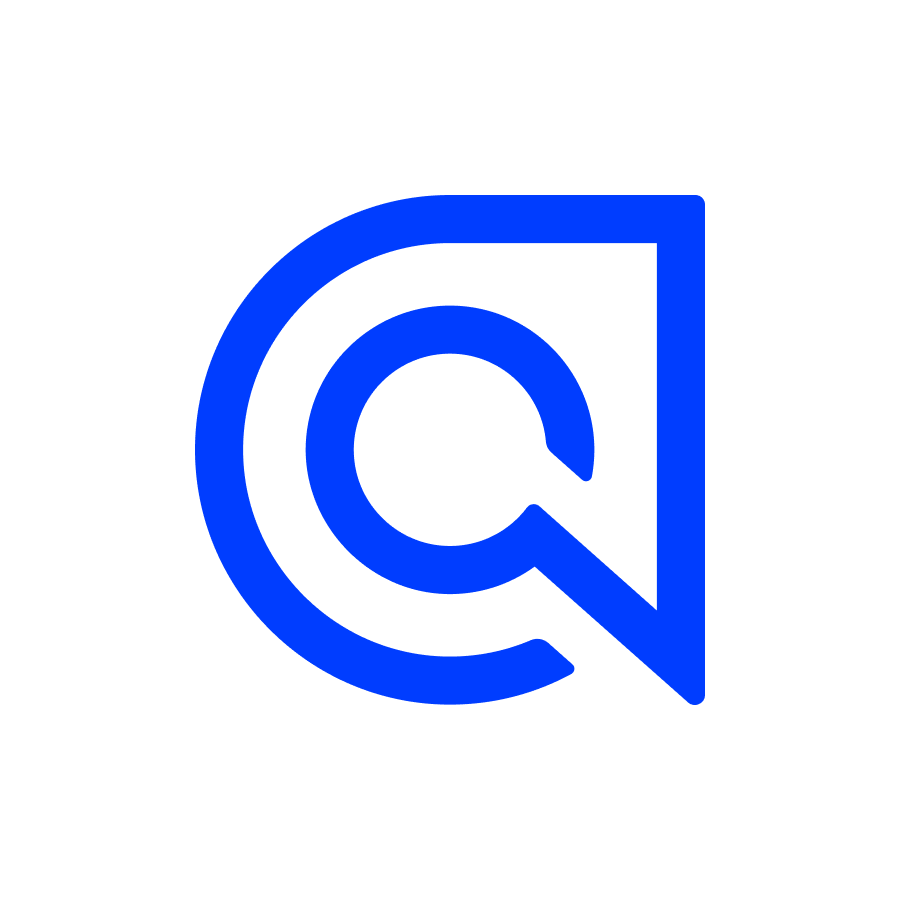
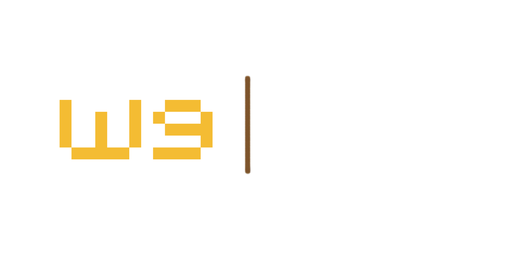

<div align="center">



# W9 Labs

**Open Source. Community Driven. Non-Profit.**

[](https://w9.se)
[](https://w9.nu)
[](LICENSE)
[](http://makeapullrequest.com)

<br />

<p align="center">
  <b>W9 Labs</b> is a non-profit collective dedicated to building accessible, transparent, and robust open-source software. We believe technology should be a commons, built by the community, for the community.
</p>

</div>

---

## 🔭 Who We Are

We are a team of developers, designers, and enthusiasts working together to create tools that empower users. As a non-profit initiative, our primary stakeholders are our users and contributors, not shareholders.

### Our Domains
* **[w9.se](https://w9.se)**: Our organizational home, governance, and long-term documentation.
* **[w9.nu](https://w9.nu)**: Our release hub, community showcase, and "what's happening now."

---

## 🚀 Our Mission

1.  **Openness:** Every line of code we produce is open source and auditable.
2.  **Community First:** We prioritize user privacy, data sovereignty, and community feedback.
3.  **Sustainability:** We build software designed to last, focusing on stability and performance.

---

## 🛠️ What We Build

### 🌐 Live Services

Our ecosystem consists of **6 Rust-based web services** (Axum backend) deployed on a single VPS with PostgreSQL, Docker Compose, and Caddy reverse proxy:

| Service | URL | Purpose |
|---------|-----|---------|
| **w9-tools** | https://tools.w9.nu | QR codes, text converter, markdown notepads, file upload/converter |
| **w9-db** | https://db.w9.nu | OAuth 2.0 / OIDC provider, user management, email settings |
| **w9-mail** | https://mail.w9.nu | Email admin panel, API tokens, Microsoft E5 SMTP |
| **w9-links-creator** | https://links.w9.nu | Short links, note drops, link API |
| **w9-daily-reminders** | https://reminder.w9.nu | AI + Google Calendar daily digest emails |
| **w9-search** | https://search.w9.nu | AI search assistant with intelligent RAG, curated Pollinations models |
| **vocai** | https://vocai.top | AI vocabulary flashcards, spaced repetition, Vocabulary Islands |
| **homepage** | https://w9.se | Main landing page (Cloudflare Pages) |

### 🎨 Design System

All services share:
- **8-Bit Voxel Arcade UI** — Premium Retro aesthetic with sharp corners, monospace fonts, and pixel-perfect design
- **Unified Color Palette** — Deep Black (`#050505`), Off-White (`#e5e5e5`), Terminal Green Accent (`#00ff41`)
- **Shared Logo System** — 7 SVG files used across all projects
- **Custom CSS Framework** — `voxel.css` for consistent styling

---

## 💻 Tech Stack

- **Language:** Rust 1.94+ (all backends)
- **Framework:** Axum 0.7 + tokio-postgres
- **Database:** PostgreSQL 16 (5 isolated databases)
- **Email:** `lettre` (SMTP → Microsoft E5)
- **Frontend:** Server-rendered HTML (no WASM)
- **Markdown:** `pulldown-cmark` + KaTeX CDN + Mermaid CDN
- **QR Codes:** `qrcode` crate (SVG output)
- **Image Processing:** `image` crate (PNG/JPG/WebP conversion)
- **Deployment:** Docker + Docker Compose + Caddy + Cloudflare
- **CI/CD:** GitHub Actions (Multi-arch: amd64 + arm64) → GHCR

---

## 🔐 Security & Auth

- **OAuth 2.0:** Centralized auth via w9-db (no client secrets)
- **Session Isolation:** Per-user database scoping via `owner_email` or `user_id`
- **Password Hashing:** Argon2id
- **Bot Protection:** Cloudflare Turnstile
- **HTTP-Only Cookies:** SameSite=Lax

### OAuth Flow (All Services)

1. User clicks "Login with W9" → Redirects to `db.w9.nu/oauth/authorize`
2. w9-db authenticates user → Returns authorization code
3. Service exchanges code for `access_token` (no client secret needed)
4. Token stored in HTTP-only cookie → Authenticated

---

## 📧 Email System

**w9-mail** provides a centralized email API:
- **SMTP Protocol:** `smtp.office365.com:587` (STARTTLS)
- **Authentication:** Microsoft E5 username + app password
- **API Endpoint:** `POST /api/email/send` with `X-API-Token` header
- **Admin Panel:** Manage E5 users, aliases, API tokens, view send logs
- **Used by:** w9-db (verification emails, password resets), w9-daily-reminders (digest delivery), other services

---

## 🚀 Deployment

### Infrastructure

```
Users → HTTPS → Cloudflare (SSL: Full) → Caddy:443 → Docker Containers → PostgreSQL 16
```

- **Server:** `ffm.w9.nu:22001` (Ubuntu 24.04 LXC)
- **Deployment Dir:** `/opt/w9-labs/`
- **Caddy Config:** `/etc/caddy/Caddyfile` (uses Docker container DNS resolution)
- **Docker Network:** `w9-labs_default` (internal DNS resolves container names)

### Deploy Commands

```bash
# View all services
docker compose ps

# Check logs
docker logs w9-db --tail 50

# Pull latest images and redeploy all services
cd /opt/w9-labs && docker compose pull && docker compose up -d

# Redeploy single service
docker compose pull w9-search && docker compose up -d w9-search
```

---

## 📚 Project Structure

Each project follows this layout:

```
<project>/
├── server/
│   ├── Cargo.toml
│   └── src/main.rs          # Axum server entry point
├── public/
│   └── w9-logo/             # 7 SVG logo files
├── infra/templates/
│   └── voxel.css            # Shared 8-bit arcade stylesheet
├── Dockerfile               # Multi-stage Rust build
├── docker-compose.yml       # Service definition
└── .env.example             # Environment template
```

---

## 🤝 Contributing

We welcome contributors of all skill levels! Whether you're fixing a typo, refactoring code, adding features, or designing assets, your help is appreciated.

### How to Get Started

1. **Explore our repositories** — Browse the [W9 Labs organization](https://github.com/w9labs)
2. **Look for labels** — Check for `good first issue`, `help wanted`, or `documentation` labels
3. **Set up locally:**
   ```bash
   git clone https://github.com/w9labs/<project>.git
   cd <project>
   cargo run              # Rust services
   npm run dev            # Frontend (if applicable)
   ```
4. **Create a feature branch** — `git checkout -b feature/my-feature`
5. **Submit a Pull Request** — We review all PRs promptly

### Development Stack

- **Rust Projects:** `cargo run`, `cargo test`, `cargo watch -x run` (requires `cargo-watch`)
- **Docker:** `docker-compose up --build -d`
- **Local Database:** PostgreSQL via Docker

### Code Style & Standards

- Follow Rust idioms and conventions
- Use meaningful variable names and structure
- Add tests for new features
- Keep CSS classes consistent with the voxel design system
- Comment only when clarification is needed

**Please review our [Code of Conduct](CODE_OF_CONDUCT.md) to ensure a welcoming environment for everyone.**

---

## 💬 Connect & Support

- **Website:** [w9.se](https://w9.se) — Governance & documentation
- **Hub:** [w9.nu](https://w9.nu) — Community showcase
- **Email:** [hi@w9.se](mailto:hi@w9.se) — Sponsorships, partnerships, questions
- **GitHub:** [github.com/w9labs](https://github.com/w9labs) — All repositories

---

## 💰 Sponsorship

W9 Labs is community-funded and graciously supported by these partners:

### 🏗️ Infrastructure Partners

<div align="center">
  <table>
    <tr>
      <td align="center" width="25%">
        <a href="https://cloudflare.com"></a><br/>
        <strong>Cloudflare</strong><br/>
        <small>Edge CDN, WAF & DDoS protection</small>
      </td>
      <td align="center" width="25%">
        <a href="https://xermius.com"></a><br/>
        <strong>Xermius</strong><br/>
        <small>SSH manager & server toolkit</small>
      </td>
      <td align="center" width="25%">
        <a href="https://cloudnest.vn"></a><br/>
        <strong>CloudNest</strong><br/>
        <small>Cloud hosting & VPS</small>
      </td>
      <td align="center" width="25%">
        <a href="https://fossvps.org"></a><br/>
        <strong>FOSSVPS</strong><br/>
        <small>Open-source hosting</small>
      </td>
    </tr>
  </table>
</div>

### 🛠️ Technology Partners

<div align="center">
  <table>
    <tr>
      <td align="center" width="20%">
        <a href="https://1password.com"></a><br/>
        <strong>1Password</strong>
      </td>
      <td align="center" width="20%">
        <a href="https://sentry.io"></a><br/>
        <strong>Sentry</strong>
      </td>
      <td align="center" width="20%">
        <a href="https://algolia.com"></a><br/>
        <strong>Algolia</strong>
      </td>
      <td align="center" width="20%">
        <a href="https://termius.com"></a><br/>
        <strong>Termius</strong>
      </td>
      <td align="center" width="20%">
        <a href="https://pollinations.ai"></a><br/>
        <strong>Pollinations</strong>
      </td>
    </tr>
  </table>
</div>

### Become a Sponsor

Want to help us build? Email [hi@w9.se](mailto:hi@w9.se) to discuss sponsorship or partnership opportunities. Check out our [homepage](https://w9.se) for more partner details.

---

## 📄 License

All W9 Labs projects are licensed under the **MIT License** — free for personal and commercial use. See individual repository LICENSE files for details.

---

<div align="center">
  
  
  <p>Built with ❤️ by the W9 Labs community.</p>
  <p><sub>A non-profit collective building open-source tools for everyone.</sub></p>
</div>
